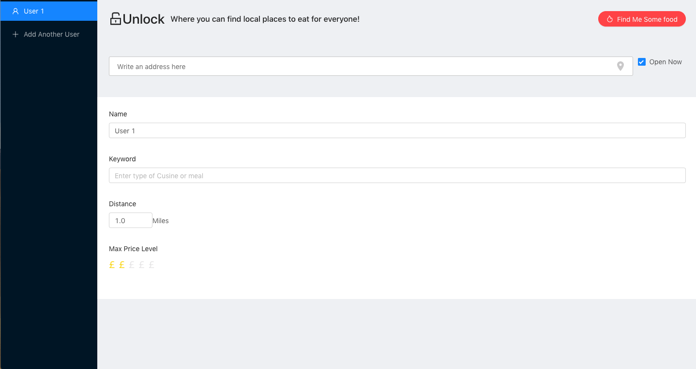

# Unlock Food app
> MVP of an app which allows you to easily make choices on a place to eat with friends

## Demo

# Features
* Add up to six users who can enter their food preferences as a restaurant, type of cuisine or a dish, users can also enter the following information to supplment their choice: 
  * Initial search location
  * Max price
  * Radius from initial search location
  * Whether they are only looking for restaurants which are open now
 * Agolia search API used for address autocomplete - down to street level 
 * A Winner is chosen at random and an accompanying location is chosen 
 * The chosen restaurant aims to maximise the choices of all participants whilst chosing the place to dine from the winners list.
 
 
 # Tools
 * React & Redux 
 * React-Router-dom
 * Ant Desgin
 * Styled Components
 * Async 
 * Agolia Search API
 * Google Places API

# Todos 
- [ ] Finish the Results view screen
- [ ] Clean up codebase for more efficient use and reading
- [ ] Add Component Unit tests
- [ ] Update CSS for reactive design.
